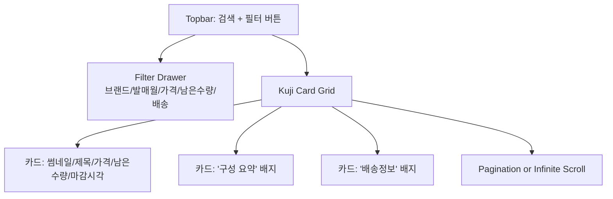
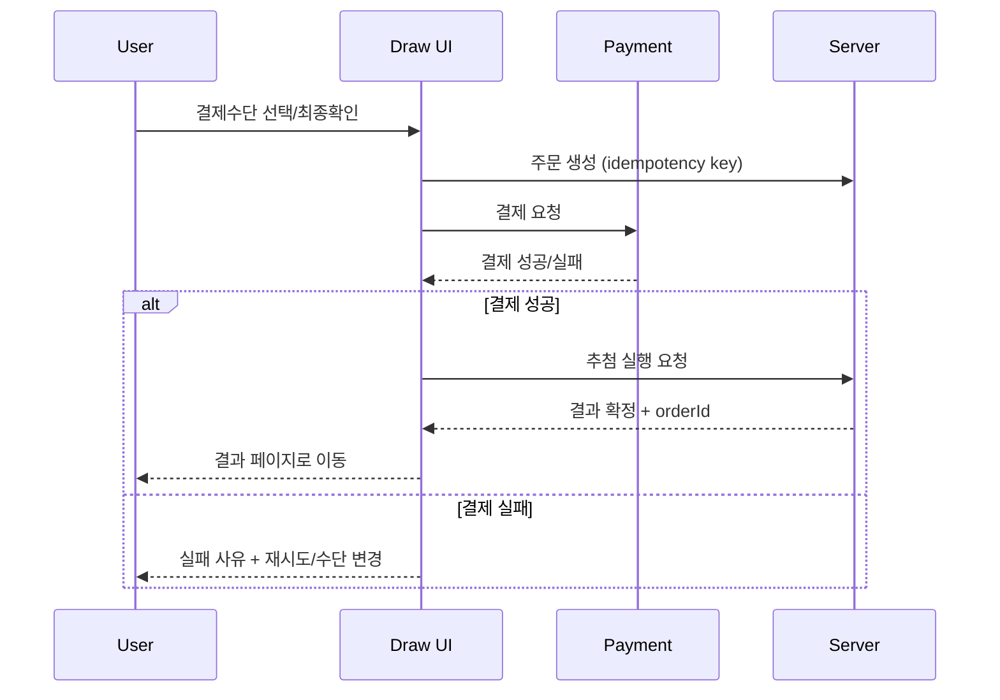
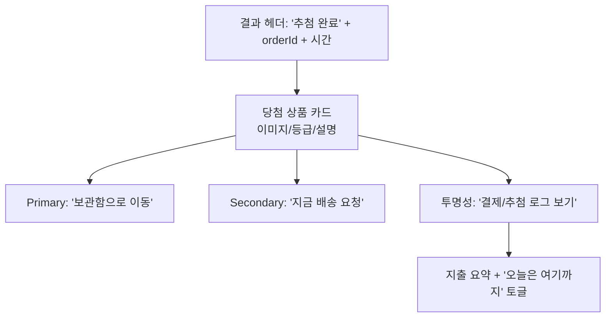
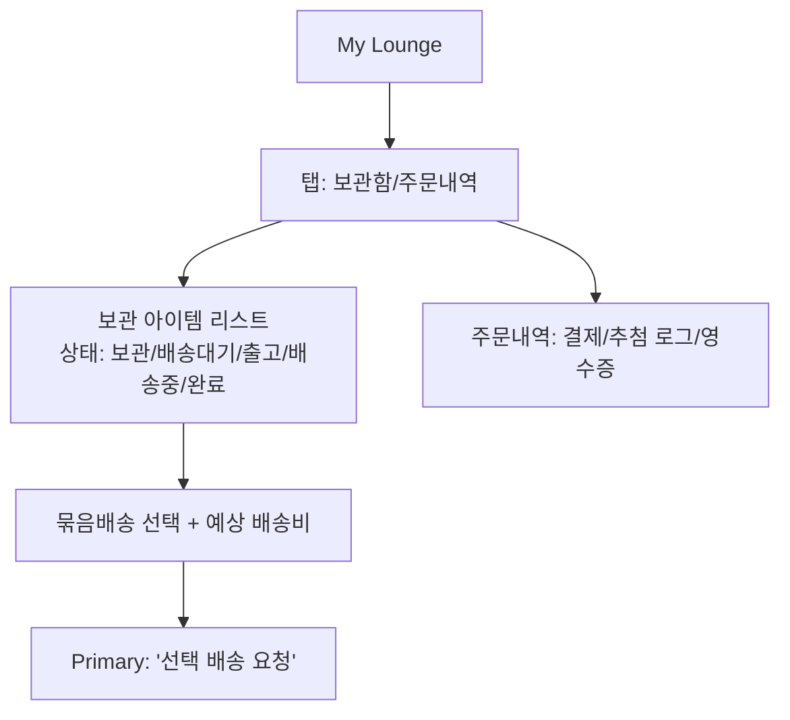
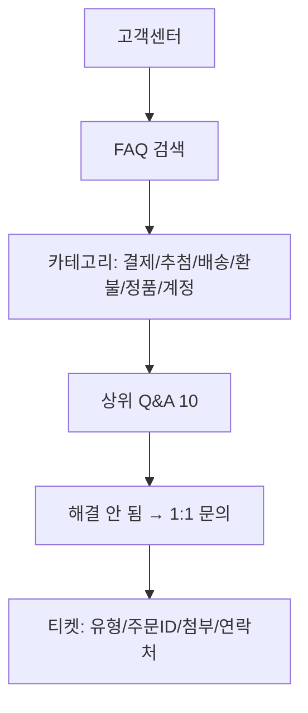

# Figu Lounge Phase1 Kuji Commerce IA·정책·UI/UX 설계 리서치 보고서

## 실행 요약

Figu Lounge(이하 “서비스”)는 **일본 신상 쿠지(제일복권 등)를 매입·운송 후 온라인에서 판매**하되, 기존 “결제 → 라이브 방송 → 수동 개봉” 방식의 병목을 제거하고 **결제 즉시 당첨 결과를 확인하는 자동화 추첨 UX**를 핵심 차별점으로 둔 커머스 모델로 정의된다(본 보고서의 전제는 사용자 제공 요약에 근거). citeturn1view0turn1view1

다만, 제공된 2개의 Gemini 공유 링크는 본 환경에서 기술적으로 열람이 실패하여(HTTP 상태 코드 오류) 원문 내용을 직접 인용·구조화하지 못했다. 따라서 “링크 원문 기반 IA/UI 분석”은 **제한적이며**, 보고서 산출물은 (1) 사용자 제공 요약 텍스트, (2) 국내 공식/준공식 법·가이드·보도자료, (3) UX/행동과학 연구를 결합해 “목업 즉시 제작 가능한 스펙” 형태로 작성한다. citeturn1view0turn1view1turn20search0turn24search6turn23search2

핵심 결론은 다음과 같다.

- **IA(정보구조)**는 “탐색(쿠지 브라우징) → 신뢰 확보(정품/재고/확률·구성 공개) → 결제·즉시 결과 → 보관/배송(묶음배송) → 사후 CS”의 단일 퍼널에 최적화해야 한다. 이는 전자상거래에서 이탈의 주요 원인(예: 추가비용, 신뢰 부족, 계정 강제, 복잡한 체크아웃)을 줄이는 방향과 정합적이다. citeturn24search6turn24search8turn15search0turn7search2  
- **정책/약관**은 표준 전자상거래 소비자 권리(청약철회 7일 등)와 환급·지연배상·결제취소 프로세스를 전면에 두고, “랜덤박스/확률형 판매에서의 정보 제공·거짓광고 금지”를 위반하지 않도록 UI에 ‘사전 고지·구성 공개·로그’가 내장되어야 한다. citeturn8search5turn7search0turn20search0turn21search7  
- **사행성(규제) 리스크**는 사업 구조상 발생 가능성이 있으므로, “확률·재고·구성·가격 정보의 투명화”와 함께 **과도한 반복 결제/충동 구매를 억제하는 안전장치(UI에서의 지출 통제, 쿨다운, 기록 열람, 심리적 압박 최소화)**를 “기능 요구사항”으로 격상해야 한다. 사행행위 정의(우연적 방법으로 득실 결정)와 유사성 논점은 법무 검토가 필요하다. citeturn17search10turn17search0turn23search11turn23news50  
- 본 보고서는 **우선순위 8개 페이지**(홈, 쿠지 리스트, 쿠지 상세, 결제·즉시추첨, 결과, 마이라운지, 배송관리, 고객센터)에 대해 **목업 수준 와이어프레임(머메이드 다이어그램) + 컴포넌트/상호작용/데이터 I/O + 에러·예외 처리**를 제시한다.

## 조사 범위와 전제

### Gemini 링크 접근성 한계

- 대상 링크: `https://gemini.google.com/share/69c2793f7faf`, `https://gemini.google.com/share/f87d556d29dd`
- 결과: 본 환경에서 두 링크 모두 열람 실패(UnexpectedStatusCode)로 원문 확인 불가. citeturn1view0turn1view1  
- 대응: 사용자 제공 요약(Phase1 비즈니스 모델/수익 구조/리스크)과 공공 출처를 기반으로 “실무 설계 산출물”을 작성.

### 범위 정의

- **Phase1**: “쿠지 물품 매입 → 온라인 판매(결제 즉시 결과) → 배송/CS” 운영에 한정(구독/멤버십/2차 거래/리세일은 가정하지 않음).
- **타깃 국가 불명**: 한국 기준(전자상거래/개인정보/표시광고/다크패턴/사행성 논점)과, 글로벌 일반 기준(EU 소비자 철회권 등)을 분리 제안. citeturn25search0turn25search5

### 근거로 활용한 핵심 출처(대표)

- 랜덤박스 판매 관련 집행·의무: entity["organization","공정거래위원회","korea competition regulator"] 보도자료(랜덤박스 판매사업자 전자상거래법 위반 제재). citeturn20search0  
- 전자상거래 소비자 철회권·환급: 전자상거래법 조문(청약철회 기간/예외 등, 환급 3영업일 등). citeturn8search5turn7search0turn7search17  
- 다크패턴: 공정위 온라인 다크패턴 자율 가이드라인 발표 보도 및 법령 개정 흐름. citeturn15search0turn7search2  
- 행동과학/UX: entity["organization","Baymard Institute","ecommerce ux research"] 쇼핑카트 이탈 사유 데이터. citeturn24search6turn24search8 / entity["people","BJ Fogg","behavior scientist"]의 FBM(B=MAP). citeturn23search2turn23search0 / entity["people","Daniel Kahneman","behavioral economist"]·entity["people","Amos Tversky","cognitive psychologist"] 전망이론(저확률 과대가중 등). citeturn24search2  
- 사행행위 정의(규제 논점 근거): entity["organization","사행산업통합감독위원회","korea gambling watchdog"] 및 특례법 정의. citeturn17search10turn17search0  
- EU(글로벌 일반 기준): entity["organization","European Commission","eu executive body"] Consumer Rights Directive 안내 및 “14일 철회권(거리판매)” 요약. citeturn25search0turn25search5  
- (참고) NN/g 원문은 본 환경에서 직접 열람이 실패하여, 10 휴리스틱은 2차 출처에 의해 참조(원문 링크는 명시됨). citeturn26view0turn25search3  

## 서비스 정의와 브랜드 톤

### 서비스 정의

서비스는 “**확률형(랜덤) 결과를 포함한 실물 상품 커머스**”로 분류하는 것이 운영·규제·UX 측면에서 안전하다. 공정위는 온라인 랜덤박스를 “우연적 요소로 서로 다른 상품이 선택될 수 있는 사행성이 가미된 상품”으로 언급하면서, 거짓·과장 광고 및 상품정보 제공의무 위반 등을 제재했다. citeturn20search0

따라서 IA/UX는 일반 이커머스(카탈로그–결제–배송) 뼈대를 유지하되, 다음 3가지가 “상시 노출되는 1급 정보”여야 한다.

- **정품·실재고·공급 프로세스**(수입/운송/검수/보관/배송)  
- **확률/구성/재고의 투명성**(후보 상품군, 수량, 등급, 남은 수량, 포함 제외 범위)  
- **구매자 보호 장치**(환불/철회 조건, 고객센터, 결제·추첨 로그, 지출 통제)

이는 체크아웃 단계에서 “신뢰 부족”이 이탈의 주요 원인으로 관측되는 점과도 일치한다. citeturn24search6turn24search8  

### 브랜드 톤과 포지셔닝 제안

“Lounge”의 네이밍을 살리려면, **‘흥분 유도형(카지노/게임)’이 아니라 ‘컬렉터를 위한 투명한 거래 라운지’** 톤이 설득력과 장기 신뢰에 유리하다(특히 랜덤형 판매의 법적·사회적 민감도 고려). citeturn20search0turn15search0turn23search11

- 톤 키워드: **투명함 / 절제된 즐거움 / 컬렉터 중심 / 책임감**
- 카피 방향(예시)
  - “결제 즉시 결과 확인. 남는 건 기록과 실물.”  
  - “확률·구성·남은 수량을 먼저 공개합니다.”  
  - “과한 결제는 막고, 배송은 편하게 묶습니다.”

## 정보구조와 사이트맵

### 사이트맵 계층 구조 테이블

| L1 | L2 | L3 | 권한 | URL 슬러그 예시 | 목적/비고 |
|---|---|---|---|---|---|
| 홈 | 랜딩 |  | Public | `/` | 가치제안·신뢰·대표 쿠지 진입 |
| 쿠지 | 쿠지 리스트 |  | Public | `/kuji` | 탐색·필터·재고/마감/신뢰 정보 |
| 쿠지 | 쿠지 상세 |  | Public | `/kuji/{kujiId}` | 구성/확률/남은수량/가격/배송 고지 |
| 구매 | 결제·즉시추첨 |  | Login | `/draw/{kujiId}` | 결제→즉시 결과(핵심 순간) |
| 구매 | 결과 확인 |  | Login | `/result/{orderId}` | 당첨 결과·보관/배송 선택 |
| 마이라운지 | 보관함 |  | Login | `/my/lounge` | 획득 아이템 인벤토리(배송 대기 포함) |
| 마이라운지 | 주문/결제 내역 |  | Login | `/my/orders` | 증빙·로그(신뢰) |
| 배송 | 배송지 관리 |  | Login | `/my/addresses` | 주소록·기본배송지 |
| 배송 | 배송 요청/묶음배송 |  | Login | `/my/shipping` | 묶음 출고·배송비 계산·트래킹 |
| 고객센터 | FAQ |  | Public | `/help/faq` | 불안 해소(환불/배송/정품/확률/오류) |
| 고객센터 | 1:1 문의 |  | Login | `/help/tickets` | 분쟁/CS 정식 채널 |
| 고객센터 | 공지 |  | Public | `/notices` | 운영 투명성(지연/입고/정책 변경) |
| 법적 | 이용약관 |  | Public | `/legal/terms` | 계약 조건 |
| 법적 | 개인정보처리방침 |  | Public | `/legal/privacy` | 개인정보 고지(제30조 취지에 맞춘 구성) citeturn9search0turn13search0 |
| 법적 | 환불/반품 정책 |  | Public | `/legal/refund` | 전자상거래법 기준을 사용자 언어로 번역 citeturn8search5turn21search7turn7search0 |
| 법적 | 확률·구성 고지 |  | Public | `/legal/odds` | 확률형 판매에서 핵심 신뢰 문서(서비스 차별점) citeturn20search0turn22search2 |
| (선택) 운영 | 관리자 |  | Admin | `/admin` | 재고·추첨로그·CS·정산 |

### 사이트맵 머메이드 다이어그램

```mermaid
flowchart TB
  A[홈 /] --> B[쿠지 /kuji]
  B --> C[쿠지 상세 /kuji/{kujiId}]
  C --> D[결제·즉시추첨 /draw/{kujiId}]
  D --> E[결과 /result/{orderId}]
  E --> F[마이라운지 /my/lounge]
  F --> G[배송요청 /my/shipping]
  F --> H[주문내역 /my/orders]
  A --> I[고객센터 /help/faq]
  I --> J[1:1 문의 /help/tickets]
  A --> K[법적 /legal/*]
  K --> K1[이용약관]
  K --> K2[개인정보처리방침]
  K --> K3[환불/반품]
  K --> K4[확률·구성 고지]
```

## 약관·정책·규제 프레임

### 핵심 리스크와 설계상 대응 포인트

- **랜덤형 판매의 정보 비대칭**: 공정위는 랜덤박스에서 “실제로 제공되지 않는 상품을 광고”, “이용후기 조작”, “상품정보 미고지”, “청약철회 방해”를 제재했다. 즉, 약관만으로 면책하기 어렵고 **UI에서 사전 고지·증거(로그)·정정/취소 절차 제공**이 필수다. citeturn20search0turn8search5  
- **사행성 논점**: 사행행위 정의(우연적 방법으로 득실 결정하여 이익 또는 손실을 주는 행위)와 구조적으로 닮아 보일 수 있어, “현금 환급/환전/캐시아웃/2차 거래” 등은 특히 민감해질 수 있다(법무 검토 전제로 안전 설계 필요). citeturn17search10turn17search0  
- **다크패턴 금지/가이드**: 옵션을 미리 선택하거나, 취소를 어렵게 만들거나, 가격을 순차 공개하는 등의 행위는 규제·자율가이드의 주요 표적이다. **결제·추첨 UX는 ‘빨리 사게 만들기’보다 ‘사용자 실수 방지’가 KPI로 우선**이어야 한다. citeturn15search0turn7search2  

### 약관/정책 핵심 조항 초안 테이블

아래는 “초안”이며, 실제 문구는 법무 검토·관할국가·결제/물류 구조에 따라 조정 전제다.

| 문서 | 조항(핵심) | 초안 요지(요약) | UI/운영 구현 메모 | 근거/참고 |
|---|---|---|---|---|
| 이용약관 | 서비스 정의 | 본 서비스는 “실물 상품(쿠지) 판매”이며, 각 구매는 미리 공개된 후보 상품군 중 1개를 무작위 방식으로 확정·공급 | 쿠지 상세에 “판매 형태(랜덤형 실물)” 라벨 고정 | citeturn20search0 |
| 이용약관 | 회원 책임 | 계정 보안, 결제수단 정당 사용, 미성년/대리결제 제한, 부정 결제/환불 악용 금지 | 로그인/결제 시 리스크 탐지(과도한 시도, 카드 도용 의심) | (일반) |
| 이용약관 | 추첨(결과) | 결과는 결제 완료 후 즉시 확정되며, 확정 이후 “결과 변경/재추첨”은 원칙적으로 불가(단, 시스템 오류 시 예외) | “추첨 확정 로그(시간/주문ID/시드 or 트랜잭션)” 조회 기능(마이라운지) | citeturn20search0 |
| 이용약관 | 서비스 가용성 | 시스템 점검/장애/결제 실패 시 처리(재시도, 환급, 결과 보류) | Draw API는 **idempotency key** 사용 / 장애 시 “결제 성공·추첨 미확정” 상태를 명확히 표기 | citeturn7search0 |
| 개인정보처리방침 | 처리 항목/목적 | 회원가입/주문/배송/CS/부정거래 방지에 필요한 최소 항목 처리 | 수집항목을 “필수/선택”으로 분리 표기 | citeturn10search0turn13search0 |
| 개인정보처리방침 | 보유기간/파기 | 법령 또는 동의 기반 보유기간, 목적 달성 시 파기 | 주문·결제·세무·분쟁 로그는 법정 보존기간과 정합 필요(별도 테이블) | citeturn10search0 |
| 개인정보처리방침 | 위탁/제3자 제공 | 결제대행/배송사/알림 발송 등 위탁 고지, 국외이전 발생 시 별도 고지 | 결제/배송 벤더별 “수탁자 리스트” 자동 생성(관리자) | citeturn13search0 |
| 결제·환불 | 청약철회 | 단순변심 철회 가능기간(재화 수령일 기준 7일 등), 예외(훼손/가치 감소 등) | “반품 가능 여부”를 **주문 단위가 아니라 ‘상품 상태’ 단위로** 판단(체크리스트) | citeturn8search5turn21search7 |
| 결제·환불 | 계약 불이행/표시광고 상이 | 표시·광고와 다르거나 계약과 다르게 이행 시 3개월/30일 규정 범위 내 철회 가능 | 쿠지 상세의 “후보상품/제조국/스펙” 미고지 금지(공정위 제재 포인트) | citeturn8search5turn20search0 |
| 결제·환불 | 환급 기한 | 청약철회 등 발생 시, 법정 기한 내 환급 및 결제사 취소 요청 | “환불 상태 머신”을 사용자에게 공개(접수→검수→승인→환급완료) | citeturn7search0 |
| 결제·환불 | 지연배상금 | 환급 지연 시 지연이자(시행령 이율) 지급 | 환급 지연 자동 계산(정산) | citeturn6search3 |
| 책임 제한 | 면책 범위 | 천재지변/항공·해운 지연 등 통제 불가 사유, 단 소비자 권리 침해 범위로 면책 불가 | 면책 문구를 “환불 불가” 논리로 오용하지 않도록 정책/CS 스크립트 분리 | citeturn20search0turn8search5 |
| 규제 코멘트 | 사행성/연령 | 사행행위 정의와 유사한 오해 방지를 위해: 확률·구성·수량 공개, 결제·이용 한도, 미성년 정책, 과소비 방지 장치 명시 | “지출 한도/쿨다운/자가 제한” 기능을 약관에 명문화(옵션이 아니라 기본값) | citeturn17search10turn23search11turn15search0 |
| 글로벌(옵션) | EU 철회권 | EU 대상 판매 시 14일 철회권(거리판매) 및 예외 고지 | 국가/지역 감지 후 약관·환불 스키마 분기(지역별 정책 템플릿) | citeturn25search0turn25search5 |

## 구매자 심리학 기반 UX 원칙과 페르소나

### 페르소나 정의 테이블

| 페르소나 | 연령/직업 | 상황/목표 | 불안/저항 | 결정 요인 | 주 사용 디바이스 |
|---|---|---|---|---|---|
| P1 컬렉터 직장인 | 28–38 / 사무직·개발자 등 | “신상 굿즈를 합리적 비용으로 확보”, 배송을 묶어서 효율화 | 가품/재고 없음/배송지연/확률 조작 의심 | 후보상품·남은수량·정품 증빙, 배송 추적, 결제 안전성 | 모바일 70% + 데스크톱 30% |
| P2 라이트 엔터테인먼트 유저 | 20–29 / 대학생·초년생 | “재미/즉시 보상”, 소액으로 경험 | 과소비·충동 결제, 결과 불만(‘쪽박’) | UX의 즉시성, 합리적 가격, 소셜 공유, “멈출 수 있는 장치” | 모바일 90% |
| P3 선물 구매자 | 30–45 / 부모/직장인 | “선물/이벤트성 구매”, 실패 확률 낮추기 | 어떤 게 나오는지 불확실, 환불/교환 걱정 | 선물용 추천, 배송일 확정, 교환/AS·CS 신뢰 | 모바일 60% + PC 40% |
| P4 리스크 민감 소비자 | 35–55 / 자영업·관리직 | “결제 안전/법적 안정”, 분쟁 시 즉시 해결 | 개인정보·결제유출, 환불 지연, CS 부재 | 사업자 정보/연락처, 정책 명확성, 로그·증빙 | PC 60% |

### 구매자 심리학 기반 설계 원칙(페이지별 매핑) 테이블

근거로는 (1) 행동 발생 조건(M·A·P)인 FBM, (2) 저확률 과대가중·확실성 효과(결정 편향), (3) 확률형 메커닉의 과소비/문제행동 연관 연구, (4) 체크아웃 이탈 데이터, (5) 다크패턴 규율을 결합한다. citeturn23search2turn24search2turn23search11turn24search6turn15search0

| 페이지 | 여정 단계 | 사용자 심리 상태(대표) | 핵심 UX 원칙 | “신뢰/불안” 처리 | 윤리/안전장치(필수) |
|---|---|---|---|---|---|
| 홈 | 인지/탐색 | 호기심 + 의심 | Ability↑(이해 쉬움), Prompt 명확 | 정품·사업자·정책 요약을 첫 화면에 | 과장 카피 금지(랜덤형 특성 명확) citeturn20search0 |
| 쿠지 리스트 | 탐색/비교 | “뭐 살까” + FOMO | 비교가 쉬워야 함(필터·정렬) | 배송비/마감/남은수량을 숨기지 않음 | 가격·비용 순차 공개 금지(총비용 조기 노출) citeturn7search2turn24search6 |
| 쿠지 상세 | 평가/결정 | 기대·확률 과대평가 가능 | 확률·구성·남은수량을 구조화 | 후보 상품/스펙 고지로 정보 비대칭 최소화 | “연속 뽑기” 유도 UI는 기본 OFF, 경고/한도 | citeturn20search0turn24search2turn23news50 |
| 결제·즉시추첨 | 구매 | 긴장 + 확실성 욕구 | 단일 경로(1 primary CTA) | 결제 안전/환불·철회 링크를 결제 근처에 | 계정 강제 최소화, 취소/뒤로가기 명확 | citeturn24search6turn15search0 |
| 결과 | 보상/실망 | 즉시 감정 피크 | “결과 → 다음 행동” 명료 | 결과 로그·증빙 제공 | ‘다시 뽑기’는 쿨다운 후 노출, 지출 요약 | citeturn23search11turn23search2 |
| 마이라운지 | 소유/관리 | 소유감, 배송 불안 | 인벤토리/상태 가시성 | 배송대기/출고/배송중 단계 명확 | 지출·주문 히스토리 쉽게 열람(자기통제) | citeturn7search0turn24search6 |
| 배송관리 | 이행/사후 | 불안(언제 오나) | 약속(ETA)·예외 대응 | 지연 시 알림/보상 기준 투명 | 주소 오류/통관/분실 대응 플로우 제공 | (법규+운영) |
| 고객센터 | 사후/회복 | 분쟁·불만 | 도움말이 “작업 중심”이어야 | 청약철회/환불/하자 기준을 쉬운 언어로 | 다크패턴 금지(탈퇴/환불 방해 금지) | citeturn8search5turn15search0 |

## 우선순위 핵심 화면 설계와 와이어프레임

### 우선순위 선정 기준

- 매출/경험의 핵심 순간: “쿠지 상세 → 결제·즉시추첨 → 결과”
- 랜덤형 판매 특성상 가장 큰 불안이 발생하는 구간: “정품/확률/배송/환불”
- 법 집행 포인트와 직접 접점: “거짓광고, 상품정보 미고지, 청약철회 방해” citeturn20search0turn8search5  

### 페이지별 스펙 테이블(우선순위 8개)

| 페이지 | 목적 | 핵심 KPI | 주요 콘텐츠 | 필수 UI 컴포넌트 | 상호작용 | 데이터 입력/출력 | 주요 페르소나 |
|---|---|---|---|---|---|---|---|
| 홈(`/`) | 신뢰 확보 + 탐색 진입 | CTR(쿠지 진입), 1분 체류, 가입 전환 | 가치제안, 인기/신상 쿠지, 운영 신뢰 블록 | 헤더(검색), 히어로 CTA, 쿠지 카드, 신뢰 배지(정책 요약), 공지 | 검색, 쿠지 클릭, “작동 방식” 모달 | In: 검색어 / Out: 추천 쿠지 리스트 | P1,P2,P3 |
| 쿠지 리스트(`/kuji`) | 탐색·비교 | 리스트→상세 전환, 필터 사용률 | 상태(판매중/마감), 가격, 남은수량, 배송 핵심 | 필터(브랜드/발매/가격/남은수량), 정렬, 카드 그리드, 비용 요약 | 필터링, 무한스크롤/페이지네이션 | In: 필터/정렬 / Out: 쿠지 목록 | P1,P2,P3 |
| 쿠지 상세(`/kuji/{id}`) | 구매 결심 | 상세→결제 전환 | 확률/구성, 남은수량, 배송/환불 요약 | 구성/등급 테이블, 남은수량, 가격/총비용 미리보기, FAQ 스니펫 | 수량 선택, “구성 보기” 토글 | In: 수량/옵션 / Out: 결제 프리뷰 | P1,P2,P3,P4 |
| 결제·즉시추첨(`/draw/{id}`) | 결제 완료 + 추첨 확정 | 결제 성공률, 결제 실패 회복률 | 결제수단, 최종 확인, 정책 동의, 추첨 실행 | 비용 브레이크다운, 결제 버튼(Primary), 취소/뒤로, 로딩/락 | 결제, 추첨 트리거, 장애 시 재시도 | In: 결제수단/동의 / Out: orderId, drawResult | P1,P2 |
| 결과(`/result/{orderId}`) | 결과 수용 + 다음 행동(보관/배송) | 결과 확인률, 배송요청 전환 | 당첨 상품 카드, 보관함 추가, 배송 옵션 | 결과 카드, “보관함으로”, “배송 요청”, 지출 요약 | 공유(선택), 배송 선택 | In: 배송 선택 / Out: inventory update | P1,P2,P3 |
| 마이라운지(`/my/lounge`) | 소유·관리 | 배송요청률, CS 발생률 감소 | 보관 아이템, 상태, 로그 | 인벤토리 테이블/카드, 상태 필터, 주문 로그 링크 | 선택 묶음배송, 상세 보기 | In: 선택 아이템 / Out: 출고 요청 draft | P1,P3 |
| 배송관리(`/my/shipping`) | 출고/추적 | 출고 완료율, 주소 오류율↓ | 주소록, 묶음배송, 운임, ETA, 트래킹 | 주소 폼, 배송비 계산, 출고 버튼, 트래킹 타임라인 | 주소 검증, 출고 요청, 트래킹 보기 | In: 주소/요청 / Out: tracking status | P1,P3,P4 |
| 고객센터(`/help/faq`) | 불안 해소/분쟁 예방 | FAQ 해결률, 1:1 문의 전환률(낮을수록) | 환불/배송/정품/확률/오류 안내 | 검색형 FAQ, 정책 카드, 문의 CTA | FAQ 검색, 티켓 생성 | In: 질의/첨부 / Out: ticketId | P3,P4 |

image_group{"layout":"carousel","aspect_ratio":"16:9","query":["ecommerce product page wireframe","checkout flow wireframe ui","dashboard inventory ui wireframe","customer support faq page design"],"num_per_query":1}

### 와이어프레임 공통 규격

- Desktop: 12-column grid / 주요 CTA는 우측 상단(상단 고정) 또는 1st viewport 내 1개만 Primary.  
- Mobile: 4-column / 하단 고정 CTA(“결제하고 결과 확인”) 1개, 보조 CTA는 상단/더보기로 분리.  
- 랜덤형 판매 특성상 **“확률·구성·남은수량·총비용·환불/철회”**는 상세/결제에서 “접을 수는 있어도 숨기지 않음”. citeturn20search0turn24search6turn7search2  

### 홈 와이어프레임

**레이아웃 목표**: 10초 안에 “무슨 서비스인지/왜 믿을 수 있는지/어디서 시작하는지”를 완료.

```mermaid
flowchart TB
  H[Header: 로고 | 검색 | 쿠지 | 고객센터 | 로그인]
  Hero[Hero: 가치제안\n'결제 즉시 결과 확인'] --> CTA1[Primary CTA: '쿠지 보러가기']
  Hero --> Trust1[신뢰 블록: 정품·재고·정책 요약]
  CTA1 --> SectionA[신상/인기 쿠지 6개 카드]
  SectionA --> SectionB[작동 방식 3단계\n(선택→결제→결과→배송)]
  SectionB --> SectionC[공지/배송지연/정책변경]
  SectionC --> Footer[Footer: 약관/개인정보/환불/확률고지]
```

- CTA 문구(권장): **“쿠지 보러가기”**, 보조: “작동 방식 보기”
- 신뢰 요소: 사업자 정보 요약, 환불/철회 링크, 랜덤형 판매 고지(한 줄), 공정위 제재 포인트(상품정보/거짓광고 방지)를 역으로 “우리는 후보·스펙 공개”로 선언. citeturn20search0  
- 예외 처리: 첫 방문 쿠키 배너(필수 최소), 로그인 없이도 리스트/상세는 열람 가능(계정 강제는 이탈 원인). citeturn24search6  

### 쿠지 리스트 와이어프레임



- 핵심: “남은수량/마감”은 과장(가짜 긴급성)으로 보이지 않게, **재고 기반이면 숫자·기준을 명시**. 타임세일·마감 카피는 공정위가 문제 삼는 허위·과장 광고 문맥과 충돌 가능성이 있어 절제. citeturn22search6turn15search0  
- 비용: 배송비가 확정이 아니더라도 “추정/기준”은 노출(추가비용은 이탈 1순위). citeturn24search6turn24search8  

### 쿠지 상세 와이어프레임

```mermaid
flowchart TB
  P[상단: 제목/상태/남은수량] --> G[Gallery/대표 이미지]
  P --> Price[가격 + 총비용 미리보기(배송/수수료 포함 정책)]
  G --> Odds[구성/등급/수량 테이블\n(후보상품/스펙 포함)]
  Odds --> Proof[투명성: '후보상품 전체 보기' + '업데이트 시각']
  Proof --> CTA[Primary: '결제하고 결과 확인']
  CTA --> Policy[환불/배송/정품 보증 요약 카드]
  Policy --> FAQ[FAQ 5개 + '전체 보기']
```

- 반드시 표기(공정위 집행 포인트 역설계):  
  - 후보상품(전체) + 각 상품의 최소 정보(상품명/제조국 등 가능 범위)  
  - “실제 미공급 상품 이미지로 유인” 금지. citeturn20search0  
- 심리 설계(확률형): 전망이론상 저확률 과대가중이 발생 가능하므로, “A상 당첨 확률”을 크게 띄우기보다 **전체 분포를 균형 표기**하고, “보관/배송 비용”까지 포함한 총비용 시야를 확보. citeturn24search2turn24search6  
- 안전장치: 수량 선택 시 “오늘 누적 지출” 미니 표시(마이라운지와 연동).

### 결제·즉시추첨 와이어프레임



- 결제 직전 체크리스트(실수 방지):  
  - “랜덤형 실물 상품 구매이며 결과가 즉시 확정됨”  
  - “청약철회/하자/미이행 시 처리 기준” 링크  
  - 총비용(가격+배송/수수료)을 최종 화면에서 재확인(순차 공개 가격책정/숨김 금지 방향). citeturn7search2turn24search6  
- 에러/예외 처리(필수)
  - **결제 성공·추첨 실패(서버 오류)**: 결과를 “보류”로 표시하고, 자동 재처리/환급 SLA를 명시(3영업일 환급 의무 등). citeturn7search0  
  - 결제 실패: 사유 분류(한도/오류/인증) + 대체수단

### 결과 와이어프레임



- 반복 구매 유도는 **윤리·규제 관점에서 통제된 방식**이 안전: 확률형 메커닉은 문제행동과의 연관이 반복적으로 보고된다. “다시 뽑기”는 기본 CTA가 아니라, 쿨다운 후(예: 30초) 보조 영역에서만 노출 권장. citeturn23search11turn23news50  

### 마이라운지 와이어프레임



- 신뢰 요소: “로그 접근성”은 랜덤형 판매에서 방어력이 된다(사용자는 ‘조작 의심’을 쉽게 한다). 공정위가 랜덤박스의 광고·후기·정보 비대칭을 문제 삼은 맥락상, ‘기록 제공’은 UX가 아니라 준법 장치다. citeturn20search0  

### 배송관리 와이어프레임

```mermaid
flowchart TB
  S1[배송관리] --> Addr[배송지 목록 + 기본배송지]
  S1 --> Bundle[묶음배송 바스켓\n(선택 아이템/부피/무게 정책)]
  Bundle --> Fee[배송비 계산(기준 공개) + ETA]
  Fee --> ShipReq[Primary: '출고 요청']
  ShipReq --> Track[트래킹 타임라인]
  Track --> Exception[예외: 주소불명/통관/분실/파손\n대응 버튼]
```

- 환급·지연배상 등 “사후 비용”이 발생하지 않게 하려면, 주소 입력은 “자유 텍스트”만으로 끝내지 말고 **검증/에러 교정 UX**가 필요. citeturn7search0  

### 고객센터 와이어프레임



- 다크패턴 관점에서 “탈퇴/환불/취소 방해” UX는 규제 타깃이므로, 고객센터는 **절차를 더 어렵게 만드는 곳이 아니라, 가장 빠른 출구**가 되어야 한다. citeturn15search0turn7search2  

## 구현 가이드

### 개발 체크리스트(Development)

- 상태 머신 정의(필수): `ORDER_CREATED → PAID → DRAW_CONFIRMED → (INVENTORY_HELD | SHIP_REQUESTED) → SHIPPED → DELIVERED → CLOSED`  
- 결제·추첨 분리: 결제 성공 후 추첨 확정이 보장되도록 **원자성(트랜잭션) 또는 보상 트랜잭션** 설계. 환급은 법정 기한 준수(3영업일 등) 로직에 포함. citeturn7search0turn7search18  
- 추첨 공정성: 최소 요건으로 “서버 타임스탬프/주문ID/결과/재고 차감”을 감사 로그에 저장하고 사용자에게 조회 제공(“로그 보기”). citeturn20search0  
- 비용 표기: 배송/수수료/세금(해외 판매 시)을 **첫 화면부터 총비용 관점으로 표시**(순차공개 가격책정/숨김 리스크). citeturn7search2turn24search6  
- 다크패턴 방지 QA: 옵션 사전선택 금지, 취소·탈퇴 경로 동일 가시성, 팝업 반복간섭 최소화. citeturn15search0turn7search2  
- 데이터 I/O 표준화: 상품(쿠지/후보상품) 스키마에 “후보상품 목록과 최소 스펙” 필드 포함(공정위 정보 제공 의무 위반 방지). citeturn20search0  

### 콘텐츠 체크리스트(Content)

- 금지 카피(리스크): “쪽박 없음”, “무조건 이득”, “대박 확정”류(거짓·과장 광고 해석 위험). citeturn20search0  
- 필수 고지: 후보상품/구성/확률/남은수량의 업데이트 시각, 총비용 구성, 환불/철회 요약. citeturn20search0turn24search6  
- 고객센터: “환불 불가” 문장 단독 사용 금지. 반드시 **법정 철회권 구조(7일, 예외, 하자 시 3개월/30일 등)**를 사용자 언어로 재서술. citeturn8search5turn21search7  

### 법무 체크리스트(Legal)

- 전자상거래:  
  - 청약철회 기간/예외/하자 철회(3개월/30일) 반영. citeturn8search5  
  - 철회 시 환급/결제취소 요청/지연배상(시행령 이율) 반영. citeturn7search0turn6search3  
- 랜덤형 판매(랜덤박스) 준법:  
  - 후보상품 “존재/공급 가능” 검증(미공급 상품 광고 금지).  
  - 후기/리뷰 조작 방지(삭제·비노출 정책 포함).  
  - 상품정보(최소 스펙) 제공 내재화. citeturn20search0  
- 사행성 논점:  
  - 사행행위 정의와의 관계를 법무 자문으로 정리(특히 현금성 환급/환전/리셀 기능 도입 전). citeturn17search10turn17search0  
  - 과소비 방지 기능(한도/자가 제한/쿨다운)과 미성년 정책을 약관에 명문화(“선택 기능”이 아니라 기본 설계). citeturn23search11turn15search0  
- 글로벌 판매 시(EU 등):  
  - 거리판매 철회권(14일) 및 예외 고지, 정보 제공 의무(판매자/주소/총비용) 현지화. citeturn25search0turn25search5turn25search2  

